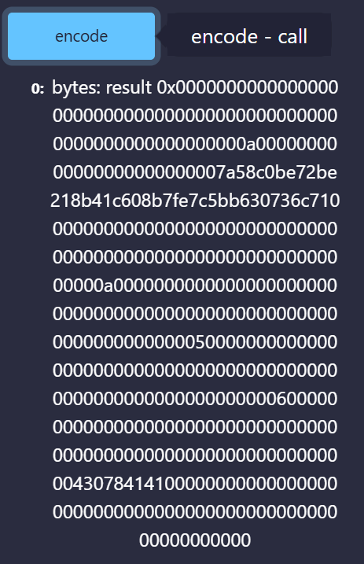
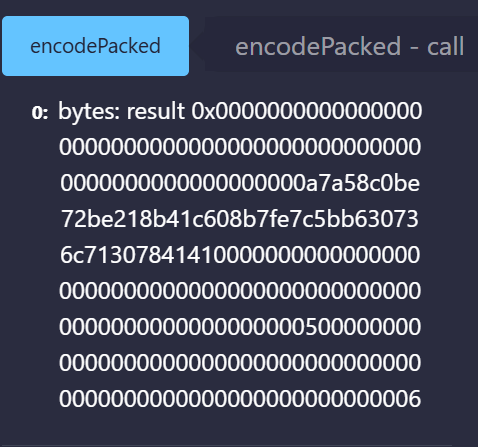
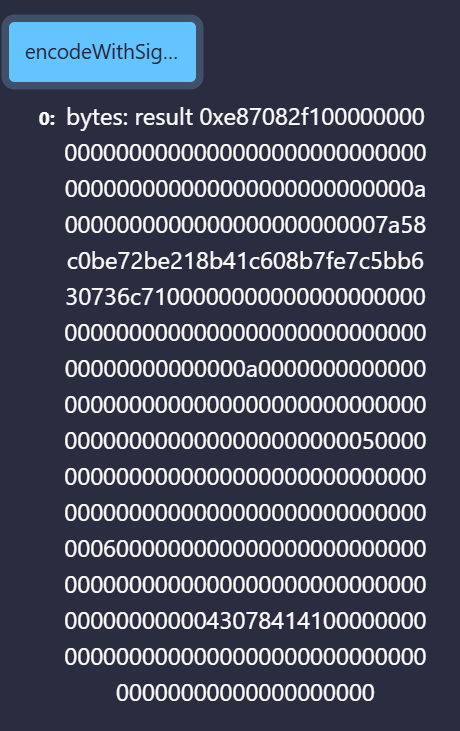
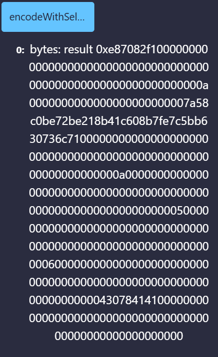
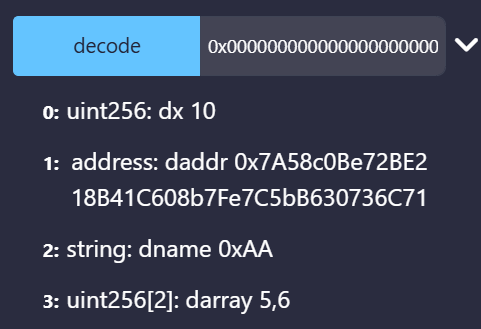

## ABI编码解码

**abi编码函数哪个更加安全：**

| 编码方式                  | 安全性     | 主要用途                        | 主要风险                                                     |
| ------------------------- | ---------- | ------------------------------- | ------------------------------------------------------------ |
| `abi.encode`              | 高         | 标准 ABI 编码、哈希签名数据     | 数据较长，但边界明确，每个参数按照32个字节进行编码           |
| `abi.encodePacked`        | 较低       | 紧凑编码、拼接数据              | 动态类型可能产生哈希碰撞，多个动态类型之间没有明确边界，动态类型有两个以上慎用 |
| `abi.encodeWithSelector`  | 较高       | 构造低级调用的 calldata         | 参数类型仍需开发者保证正确，参数顺序写反时，可能仍然生成字节数据。 |
| `abi.encodeWithSignature` | 一般       | 通过函数签名字符串构造 calldata | 函数签名是字符串，编译器不会充分检查字符串内容。字符串拼错也能编译，会意外调用另一个选择器碰撞的函数 |
| `abi.encodeCall`          | 最高，推荐 | 类型安全地构造函数调用 calldata | 需要较新的 Solidity 版本                                     |

ABI编码有4个函数：`abi.encode`, `abi.encodePacked`, `abi.encodeWithSignature`, `abi.encodeWithSelector`。而ABI解码有1个函数：`abi.decode`，用于解码`abi.encode`的数据。

abi的作用是把我们在前端的意图翻译一下，变成机器能够读懂的语言，进行执行

### abi.encode

我们将编码4个变量，他们的类型分别是`uint256`, `address`, `string`, `uint256[2]`：

```
uint x = 10;
address addr = 0x7A58c0Be72BE218B41C608b7Fe7C5bB630736C71;
string name = "0xAA";
uint[2] array = [5, 6];
```

进行编码

```
function encode() public view returns(bytes memory result) {
    result = abi.encode(x, addr, name, array);
}
```

编码结果：


```
000000000000000000000000000000000000000000000000000000000000000a    // x
0000000000000000000000007a58c0be72be218b41c608b7fe7c5bb630736c71    // addr
00000000000000000000000000000000000000000000000000000000000000a0    // name 参数的偏移量
0000000000000000000000000000000000000000000000000000000000000005    // array[0]
0000000000000000000000000000000000000000000000000000000000000006    // array[1]
0000000000000000000000000000000000000000000000000000000000000004    // name 参数的长度为4字节
3078414100000000000000000000000000000000000000000000000000000000    // name
```

### abi.encodePacked

将给定参数根据其所需最低空间编码。它类似 `abi.encode`，但是会把其中填充的很多`0`省略。比如，只用1字节来编码`uint8`类型。当你想省空间，并且不与合约交互的时候，可以使用`abi.encodePacked`，例如算一些数据的`hash`时。需要注意，`abi.encodePacked`因为不会做填充，所以不同的输入在拼接后可能会产生相同的编码结果，导致冲突，这也带来了潜在的安全风险.

```
function encodePacked() public view returns(bytes memory result) {
    result = abi.encodePacked(x, addr, name, array);
}
```

编码结果：




### abi.encodeWithSignature

与`abi.encode`功能类似，只不过第一个参数为函数签名，比如`"foo(uint256,address,string,uint256[2])"`。当调用其他合约的时候可以使用。

```
function encodeWithSignature() public view returns(bytes memory result) {
    result = abi.encodeWithSignature("foo(uint256,address,string,uint256[2])", x, addr, name, array);
}
```



### abi.encodeWithSelector

与`abi.encodeWithSignature`功能类似，只不过第一个参数为函数选择器，为函数签名Keccak哈希的前4个字节。

```
function encodeWithSelector() public view returns(bytes memory result) {
    result = abi.encodeWithSelector(bytes4(keccak256("foo(uint256,address,string,uint256[2])")), x, addr, name, array);
}
```



### ABI解码(abi.decode)

`abi.decode`用于解码`abi.encode`生成的二进制编码，将它还原成原本的参数。

```
function decode(bytes memory data) public pure returns(uint dx, address daddr, string memory dname, uint[2] memory darray) {
    (dx, daddr, dname, darray) = abi.decode(data, (uint, address, string, uint[2]));
}
```


