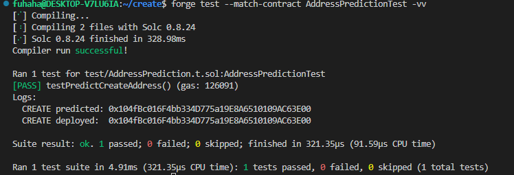
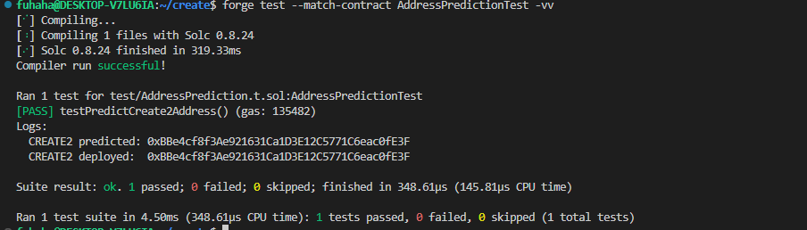
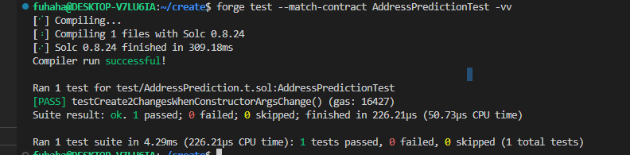
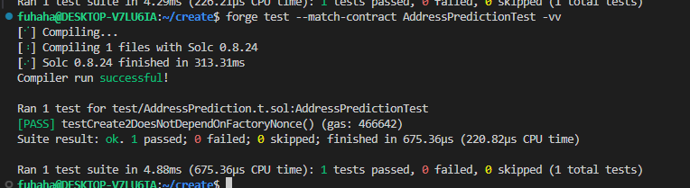
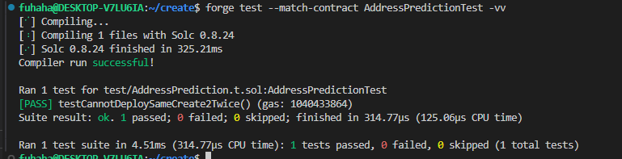

## Create and Create2

create用法：

`Contract x = new Contract{value: _value}(params)`

使用create部署新合约时，地址不是随机分配得到的，是根据公式计算出来的，所以在部署之前就已确定合约地址

create计算地址：

`新合约地址 = Hash(创建者的地址, 创建者的 Nonce)`

假设部署者的地址 = `0x1234567890123456789012345678901234567890`

Nonce = 5

```
keccak256(RLP([0x1234567890123456789012345678901234567890, 5])) 的后 20 字节(地址需要取后20字节)
```

在脚本中可以这样得到地址：`predicted = vm.computeCreateAddress(deployer, nonce);`

但是如果创造者在部署目标合约之前，多部署一个合约，Nonce值就会发生改变，导致合约的最终地址变化，所以用create预测的地址不一定完全准确

create2用法：

`Contract x = new Contract{salt: _salt, value: _value}(params)`

create2计算地址：

`新地址 = hash("0xFF",创建者地址, salt, initcode)`

```
address = address(uint160(uint256(keccak256(
    abi.encodePacked(
        bytes1(0xff),
        deployer,
        salt,
        keccak256(initcode)
    )
))));
```

- `0xFF`：一个常数，避免和`CREATE`冲突
- `CreatorAddress`: 调用 CREATE2 的当前合约（创建合约）地址。
- `salt`：一个创建者指定的`bytes32`类型的值，它的主要目的是用来影响新创建的合约的地址。
- `initcode`: 新合约的初始字节码（合约的Creation Code和构造函数的参数）。

常见的部署方式：

`Target target = new Target{salt: salt}(arg1, arg2);`

**如何计算salt？**

通常是由创建者指定的`bytes32`类型的值

最简单的可以直接写

`bytes32 salt = bytes32(0);`  或 `bytes32 salt = keccak256("my-salt");`

也可以把业务信息编码后哈希成 bytes32

```solidity
bytes32 salt = keccak256(
    abi.encode(user, campaignId, nonce)
);
```

**如何计算initcode？**

`InitCode = 原始创建字节码 (CreationCode) + ABI 编码后的构造函数参数`

`type(合约名).creationCode`

```
bytes memory initcode = abi.encodePacked(
    type(Target).creationCode,
    abi.encode(constructorArg1, constructorArg2)
);
```

constructorArg1, constructorArg2代表占位变量，具体应该看构造函数中有几个参数
如果合约中没有构造函数参数，则不需要追加abi.encode

### create预测合约实操

一共有三个合约，`Child`合约用来被部署，`Factory`合约中的函数可以用`create`,`create2`部署合约，或者预测合约地址。`AddressPrediction.t`合约是为了判断生成的合约地址是否相同

**预测地址的函数在`Factory`函数中**

**注意**：`vm.computeCreate2Address` 的函数签名规定了参数位置：

```
computeCreate2Address(
    bytes32 salt,
    bytes32 initCodeHash,
    address deployer
)
//如果顺序改变，预测出的地址将改变
```

合约内部逻辑正确即可，主要目的是为了查看这个合约的地址

```
// SPDX-License-Identifier: MIT
pragma solidity ^0.8.24;

contract Child {
    uint256 public immutable value;
    address public immutable creator;

    constructor(uint256 value_) {
        value = value_;
        creator = msg.sender;
    }
}
```

Factory合约
```
// SPDX-License-Identifier: MIT
pragma solidity ^0.8.24;

import {Child} from "./Child.sol";

contract Factory {
    event ChildDeployed(address indexed child, bytes32 indexed salt, uint256 value);
// 用create创造新合约
    function deployCreate(uint256 value) external returns (Child child) {
        child = new Child(value);

        emit ChildDeployed(address(child), bytes32(0), value);
    }
// 用create2创造新合约
    function deployCreate2(bytes32 salt, uint256 value) external returns (Child child) {
        child = new Child{salt: salt}(value);

        emit ChildDeployed(address(child), salt, value);
    }
// 用来得到initcode,后续用create2预测合约的时候需要
    function getInitCodeHash(uint256 value) public pure returns (bytes32) {
        bytes memory initCode = abi.encodePacked(type(Child).creationCode, abi.encode(value));

        return keccak256(initCode);
    }
// 不借助vm作弊码的情况下,用create2预测合约地址,
    function predictCreate2(bytes32 salt, uint256 value) public view returns (address) {
        bytes32 digest = keccak256(abi.encodePacked(bytes1(0xff), address(this), salt, getInitCodeHash(value)));

        return address(uint160(uint256(digest)));
    }
}
```

AddressPrediction.t合约，用来判断各种方法预测的合约地址是否相等

```
// SPDX-License-Identifier: MIT
pragma solidity ^0.8.24;

import {Test} from "forge-std/Test.sol";
import {Child} from "../src/Child.sol";
import {Factory} from "../src/Factory.sol";
import {console2} from "forge-std/console2.sol";

contract AddressPredictionTest is Test {
    Factory internal factory;

    function setUp() public {
        factory = new Factory();
    }

    function testPredictCreateAddress() public {

        uint64 nonce = vm.getNonce(address(factory));

        address predicted = vm.computeCreateAddress(address(factory), nonce);

        Child deployed = factory.deployCreate(42);

        console2.log("CREATE predicted:", predicted);
        console2.log("CREATE deployed: ", address(deployed));

        assertEq(address(deployed), predicted, "CREATE address mismatch");

        assertEq(deployed.value(), 42);
        assertEq(deployed.creator(), address(factory));
    }

    function testPredictCreate2Address() public {
        bytes32 salt = keccak256("my-first-salt");
        uint256 value = 42;

        bytes32 initCodeHash = keccak256(abi.encodePacked(type(Child).creationCode, abi.encode(value)));

        address foundryPrediction = vm.computeCreate2Address(salt, initCodeHash, address(factory));

        address factoryPrediction = factory.predictCreate2(salt, value);

        assertEq(foundryPrediction, factoryPrediction);

        Child deployed = factory.deployCreate2(salt, value);

        console2.log("CREATE2 predicted:", foundryPrediction);
        console2.log("CREATE2 deployed: ", address(deployed));

        assertEq(address(deployed), foundryPrediction, "CREATE2 address mismatch");

        assertEq(deployed.value(), value);
    }

    function testCreate2ChangesWhenConstructorArgsChange() public view {
        bytes32 salt = keccak256("same-salt");

        address predictionA = factory.predictCreate2(salt, 100);
        address predictionB = factory.predictCreate2(salt, 200);

        assertNotEq(predictionA, predictionB);
    }

    function testCreate2DoesNotDependOnFactoryNonce() public {
        bytes32 salt = keccak256("stable-address");
        uint256 value = 99;

        address beforeDeployment = factory.predictCreate2(salt, value);

        factory.deployCreate(1);
        factory.deployCreate(2);
        factory.deployCreate(3);

        address afterDeployment = factory.predictCreate2(salt, value);

        assertEq(beforeDeployment, afterDeployment);

        Child deployed = factory.deployCreate2(salt, value);
        assertEq(address(deployed), beforeDeployment);
    }

    function testCannotDeploySameCreate2Twice() public {
        bytes32 salt = keccak256("duplicate");
        uint256 value = 123;

        factory.deployCreate2(salt, value);

        vm.expectRevert();
        factory.deployCreate2(salt, value);
    }
}
```

利用create预测地址：

```
function testPredictCreateAddress() public {
// 获取factory合约的当前Nonce
        uint64 nonce = vm.getNonce(address(factory));
// 利用create预测地址
        address predicted = vm.computeCreateAddress(address(factory), nonce);
// 利用factory中的create2部署新合约
        Child deployed = factory.deployCreate(42);

        console2.log("CREATE predicted:", predicted);
        console2.log("CREATE deployed: ", address(deployed));

        assertEq(address(deployed), predicted, "CREATE address mismatch");

        assertEq(deployed.value(), 42);
        assertEq(deployed.creator(), address(factory));
    }
```



观察到利用`vm`作弊码提前预测的地址和部署的地址相同。并且断言函数都没有回滚

利用create2预测地址：

```
    function testPredictCreate2Address() public {
// 先定义salt和initcode的值
        bytes32 salt = keccak256("my-first-salt");
        uint256 value = 42;

        bytes32 initCodeHash = keccak256(abi.encodePacked(type(Child).creationCode, abi.encode(value)));
// // 利用vm作弊码预测地址
        address foundryPrediction = vm.computeCreate2Address(salt, initCodeHash, address(factory));
// // 不借助vm作弊码的情况下,用create2预测合约地址,
        address factoryPrediction = factory.predictCreate2(salt, value);

        assertEq(foundryPrediction, factoryPrediction);
// 用create2创造新合约
        Child deployed = factory.deployCreate2(salt, value);

        console2.log("CREATE2 predicted:", foundryPrediction);
        console2.log("CREATE2 deployed: ", address(deployed));

        assertEq(address(deployed), foundryPrediction, "CREATE2 address mismatch");

        assertEq(deployed.value(), value);
    }
```



判断CREATE2 的预测地址是否会受到构造函数参数影响。

```
    function testCreate2ChangesWhenConstructorArgsChange() public view {
        bytes32 salt = keccak256("same-salt");

        address predictionA = factory.predictCreate2(salt, 100);
        address predictionB = factory.predictCreate2(salt, 200);

        assertNotEq(predictionA, predictionB);
    }

```



依旧通过，由断言可以看出两个值不相等，所以构造函数的参数是有影响的

判断Nonce值是否会对create2预测地址产生影响

```
function testCreate2DoesNotDependOnFactoryNonce() public {
        bytes32 salt = keccak256("stable-address");
        uint256 value = 99;

        address beforeDeployment = factory.predictCreate2(salt, value);

        factory.deployCreate(1);
        factory.deployCreate(2);
        factory.deployCreate(3);

        address afterDeployment = factory.predictCreate2(salt, value);

        assertEq(beforeDeployment, afterDeployment);

        Child deployed = factory.deployCreate2(salt, value);
        assertEq(address(deployed), beforeDeployment);
    }
```



由断言可以看出，部署前后的地址依旧相等，并且预测正确

验证同一个 Factory 不能使用完全相同的 `salt` 和构造参数，通过 CREATE2 重复部署两次。

不能部署两次的原因：EVM 不允许 CREATE2 覆盖一个已经存在的合约

```
    function testCannotDeploySameCreate2Twice() public {
        bytes32 salt = keccak256("duplicate");
        uint256 value = 123;

        factory.deployCreate2(salt, value);
// 如果下一次合约调用发生回滚,则测试通过,否则失败
        vm.expectRevert();
        factory.deployCreate2(salt, value);
    }
```



